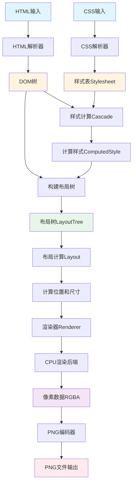
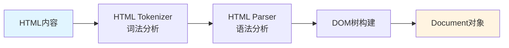
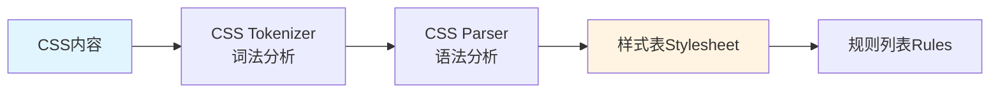
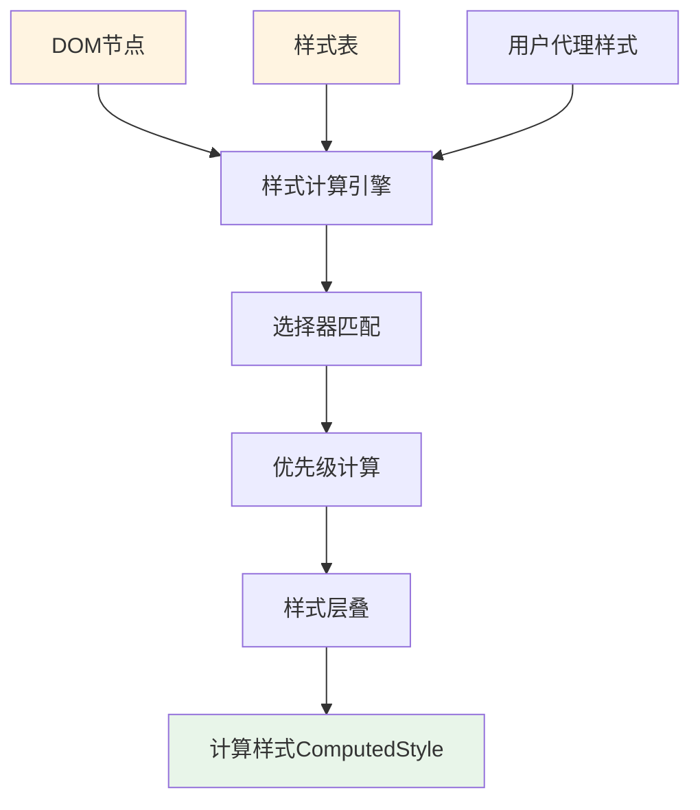
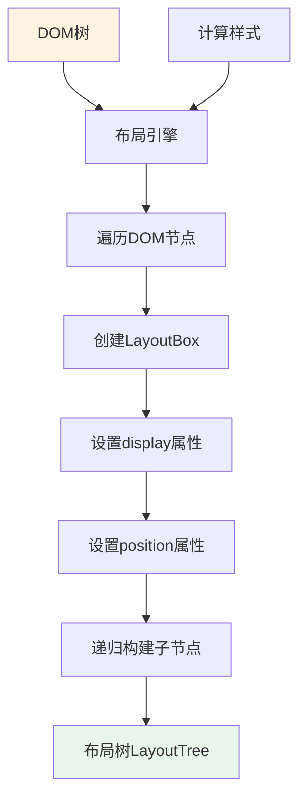
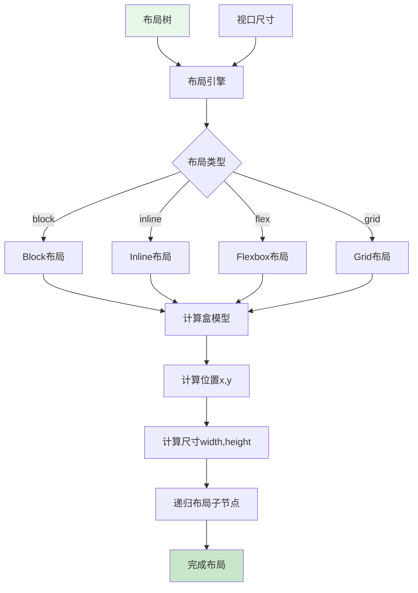
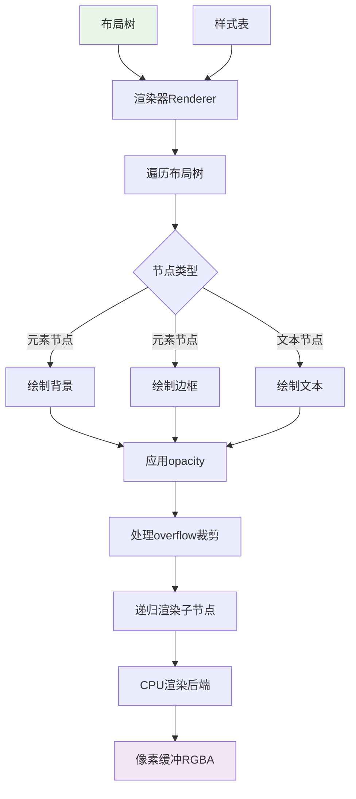
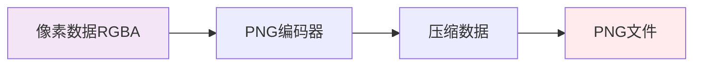
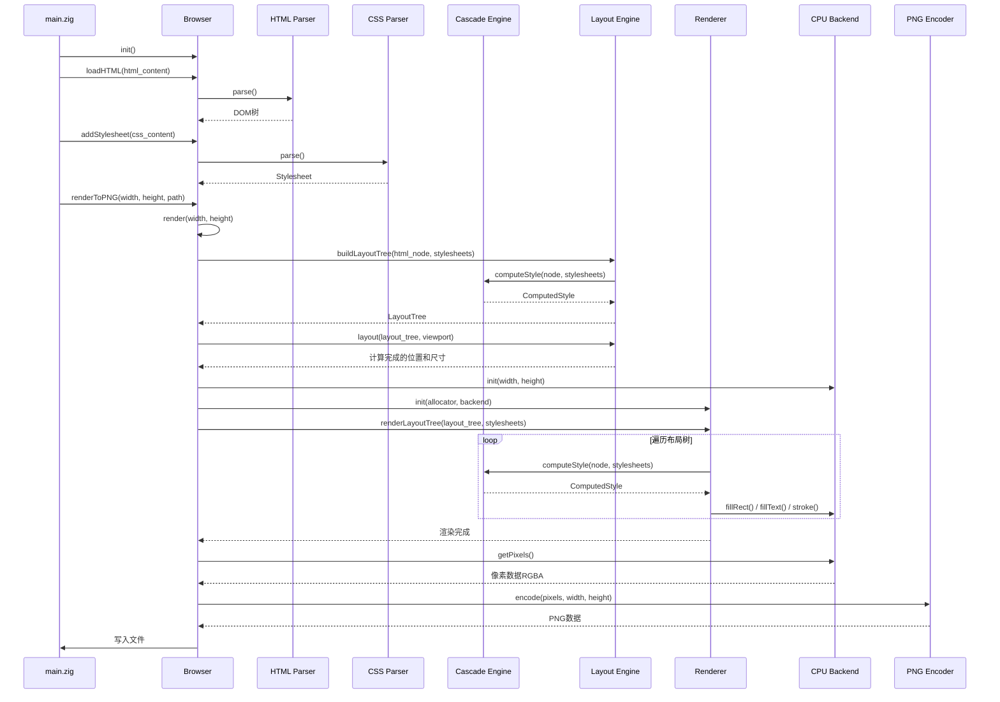
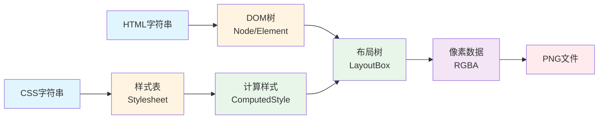

# ZBrowser 渲染流程图

本文档详细描述了ZBrowser headless浏览器渲染引擎的完整渲染流程，从HTML输入到PNG输出的全过程。

## 渲染流程总览



## 详细流程步骤

### 1. HTML解析阶段



**关键模块**：
- `src/html/tokenizer.zig` - HTML词法分析器
- `src/html/parser.zig` - HTML5解析器
- `src/html/dom.zig` - DOM树结构

**主要步骤**：
1. **词法分析**：将HTML字符串转换为Token序列（标签、属性、文本、注释等）
2. **语法分析**：根据HTML5规范的状态机解析Token，处理各种插入模式
3. **DOM构建**：创建Node、Element、Document等DOM节点，构建树形结构

**代码位置**：
```58:112:src/main.zig
    /// 渲染页面
    /// 返回渲染后的像素数据（RGBA格式）
    pub fn render(self: *Browser, width: u32, height: u32) ![]u8 {
        // 1. 获取DOM根节点
        const html_node = self.document.getDocumentElement() orelse return error.NoDocumentElement;

        // 2. 构建布局树
        var layout_engine_instance = layout_engine.LayoutEngine.init(self.allocator);
        const layout_tree = try layout_engine_instance.buildLayoutTree(html_node, self.stylesheets.items);
        defer layout_tree.deinitAndDestroyChildren();
        defer self.allocator.destroy(layout_tree);

        // 3. 执行布局计算
        const viewport = box.Size{ .width = @as(f32, @floatFromInt(width)), .height = @as(f32, @floatFromInt(height)) };
        try layout_engine_instance.layout(layout_tree, viewport, self.stylesheets.items);

        // 3.5. 输出元素的布局信息（用于与Chrome对比）
        // 先输出 html 元素
        try block.printElementLayoutInfo(layout_tree, self.allocator, self.stylesheets.items);
        
        // 查找body元素
        var body: ?*box.LayoutBox = null;
        for (layout_tree.children.items) |child| {
            if (child.node.node_type == .element) {
                if (child.node.asElement()) |elem| {
                    if (std.mem.eql(u8, elem.tag_name, "body")) {
                        body = child;
                        break;
                    }
                }
            }
        }
        if (body) |b| {
            // 输出 body 元素的布局信息（用于与Chrome对比）
            try block.printElementLayoutInfo(b, self.allocator, self.stylesheets.items);
            
            // 输出第一个 h1 元素的布局信息（用于与Chrome对比）
            if (block.findElement(b, "h1", null, null)) |h1_element| {
                try block.printElementLayoutInfo(h1_element, self.allocator, self.stylesheets.items);
            } else {
                std.debug.print("Warning: h1 element not found in body\n", .{});
            }
        } else {
            std.debug.print("Warning: body element not found\n", .{});
        }

        // 4. 创建CPU渲染后端
        const render_backend = try cpu_backend.CpuRenderBackend.init(self.allocator, width, height);
        defer render_backend.deinit();

        // 5. 创建渲染器并渲染布局树
        var renderer_instance = renderer.Renderer.init(self.allocator, &render_backend.base);
        try renderer_instance.renderLayoutTree(layout_tree, self.stylesheets.items);

        // 6. 获取渲染后的像素数据
        return try render_backend.getPixels(self.allocator);
    }
```

### 2. CSS解析阶段



**关键模块**：
- `src/css/tokenizer.zig` - CSS词法分析器
- `src/css/parser.zig` - CSS解析器
- `src/css/selector.zig` - 选择器匹配

**主要步骤**：
1. **词法分析**：将CSS字符串转换为Token序列
2. **语法分析**：解析CSS规则、选择器、声明
3. **样式表构建**：创建Stylesheet对象，包含规则列表

**代码位置**：
```47:54:src/main.zig
    /// 添加CSS样式表
    pub fn addStylesheet(self: *Browser, css_content: []const u8) !void {
        var css_parser_instance = css_parser.Parser.init(css_content, self.allocator);
        defer css_parser_instance.deinit();

        const stylesheet = try css_parser_instance.parse();
        try self.stylesheets.append(self.allocator, stylesheet);
    }
```

### 3. 样式计算阶段（Cascade）



**关键模块**：
- `src/css/cascade.zig` - 样式层叠计算引擎

**主要步骤**：
1. **选择器匹配**：为每个DOM节点匹配所有相关的CSS规则
2. **优先级计算**：根据选择器特异性、来源、重要性计算优先级
3. **样式层叠**：按照优先级合并样式属性
4. **值计算**：将相对值（如百分比、em）转换为绝对值（px）

**代码位置**：
```56:59:src/render/renderer.zig
        // 计算样式（用于获取颜色、背景等）
        var cascade_engine = cascade.Cascade.init(self.allocator);
        var computed_style = try cascade_engine.computeStyle(layout_box.node, self.stylesheets);
        defer computed_style.deinit();
```

### 4. 构建布局树阶段



**关键模块**：
- `src/layout/engine.zig` - 布局引擎
- `src/layout/box.zig` - 布局框结构

**主要步骤**：
1. **遍历DOM树**：递归遍历所有DOM节点
2. **创建LayoutBox**：为每个DOM节点创建对应的LayoutBox
3. **应用计算样式**：从ComputedStyle中提取display、position等布局相关属性
4. **构建树结构**：建立LayoutBox之间的父子关系

**代码位置**：
```26:66:src/layout/engine.zig
    /// 计算样式并应用到布局框
    pub fn buildLayoutTree(self: *LayoutEngine, node: *dom.Node, stylesheets: []const css_parser.Stylesheet) !*box.LayoutBox {
        // 创建布局框
        const layout_box = try self.allocator.create(box.LayoutBox);
        errdefer self.allocator.destroy(layout_box);

        // 直接初始化字段，而不是使用结构体赋值
        // 这样可以确保ArrayList字段被正确初始化
        layout_box.node = node;
        layout_box.box_model = box.BoxModel{
            .content = box.Rect{ .x = 0, .y = 0, .width = 0, .height = 0 },
            .padding = box.Edges{ .top = 0, .right = 0, .bottom = 0, .left = 0 },
            .border = box.Edges{ .top = 0, .right = 0, .bottom = 0, .left = 0 },
            .margin = box.Edges{ .top = 0, .right = 0, .bottom = 0, .left = 0 },
            .box_sizing = .content_box,
            .border_radius = null, // 默认无圆角
            .min_width = null, // 默认无最小宽度限制
            .min_height = null, // 默认无最小高度限制
            .max_width = null, // 默认无最大宽度限制
            .max_height = null, // 默认无最大高度限制
        };
        layout_box.display = .block;
        layout_box.position = .static;
        layout_box.position_top = null;
        layout_box.position_right = null;
        layout_box.position_bottom = null;
        layout_box.position_left = null;
        layout_box.float = .none;
        layout_box.grid_row_start = null;
        layout_box.grid_row_end = null;
        layout_box.grid_column_start = null;
        layout_box.grid_column_end = null;
        layout_box.text_align = .left; // 默认左对齐
        layout_box.text_decoration = .none; // 默认无装饰
        layout_box.line_height = .normal; // 默认行高
        layout_box.overflow = .visible; // 默认不裁剪
        layout_box.letter_spacing = null; // 默认无额外字符间距
        layout_box.opacity = 1.0; // 默认完全不透明
        layout_box.z_index = null; // 默认使用auto堆叠顺序
        layout_box.vertical_align = .baseline; // 默认基线对齐
        layout_box.white_space = .normal; // 默认正常处理空白字符
```

### 5. 布局计算阶段



**关键模块**：
- `src/layout/engine.zig` - 布局引擎主入口
- `src/layout/block.zig` - Block布局算法
- `src/layout/inline.zig` - Inline布局算法
- `src/layout/flexbox.zig` - Flexbox布局算法
- `src/layout/grid.zig` - Grid布局算法
- `src/layout/position.zig` - 定位布局算法
- `src/layout/float.zig` - 浮动布局算法

**主要步骤**：
1. **确定布局类型**：根据display属性选择布局算法
2. **计算盒模型**：计算padding、border、margin
3. **计算位置**：根据布局算法计算元素的x、y坐标
4. **计算尺寸**：根据布局算法计算元素的width、height
5. **递归布局**：对子节点递归执行布局计算

**布局类型**：
- **Block布局**：块级格式化上下文（BFC）
- **Inline布局**：行内格式化上下文（IFC）
- **Flexbox布局**：弹性盒子布局
- **Grid布局**：网格布局
- **定位布局**：absolute、relative、fixed、sticky
- **浮动布局**：float: left/right

### 6. 渲染阶段



**关键模块**：
- `src/render/renderer.zig` - 渲染器
- `src/render/cpu_backend.zig` - CPU渲染后端
- `src/render/backend.zig` - 渲染后端接口

**主要步骤**：
1. **遍历布局树**：递归遍历所有LayoutBox
2. **绘制背景**：根据background-color绘制背景
3. **绘制边框**：根据border属性绘制边框
4. **绘制文本**：使用字体渲染器绘制文本内容
5. **应用效果**：处理opacity、box-shadow等效果
6. **处理裁剪**：根据overflow属性裁剪内容
7. **递归渲染**：对子节点递归执行渲染

**渲染顺序**（从下到上）：
1. Box-shadow（阴影）
2. Background（背景）
3. Children（子元素）
4. Content（文本内容）
5. Border（边框）

**代码位置**：
```34:177:src/render/renderer.zig
    /// 渲染单个布局框
    fn renderLayoutBox(self: *Renderer, layout_box: *box.LayoutBox) !void {
        // 如果display为none，不渲染
        if (layout_box.display == .none) {
            return;
        }

        // 跳过title、head、meta、script、style等元数据标签（它们不应该在页面中渲染）
        if (layout_box.node.node_type == .element) {
            if (layout_box.node.asElement()) |elem| {
                const tag_name = elem.tag_name;
                if (std.mem.eql(u8, tag_name, "title") or
                    std.mem.eql(u8, tag_name, "head") or
                    std.mem.eql(u8, tag_name, "meta") or
                    std.mem.eql(u8, tag_name, "script") or
                    std.mem.eql(u8, tag_name, "style") or
                    std.mem.eql(u8, tag_name, "link"))
                {
                    return;
                }
            }
        }

        // 计算样式（用于获取颜色、背景等）
        var cascade_engine = cascade.Cascade.init(self.allocator);
        var computed_style = try cascade_engine.computeStyle(layout_box.node, self.stylesheets);
        defer computed_style.deinit();

        // 获取布局框的位置和尺寸
        const content_box_rect = layout_box.box_model.content;
        const total_size = layout_box.box_model.totalSize();

        // 转换为backend.Rect
        const content_rect = backend.Rect.init(
            content_box_rect.x,
            content_box_rect.y,
            content_box_rect.width,
            content_box_rect.height,
        );

        // 计算边框框的位置（包含padding和border，但不包含margin）
        // border_rect用于绘制背景和边框，margin是元素外部的空间，不应该影响绘制位置
        const border_x = content_box_rect.x - layout_box.box_model.padding.left - layout_box.box_model.border.left;
        const border_y = content_box_rect.y - layout_box.box_model.padding.top - layout_box.box_model.border.top;
        const border_rect = backend.Rect.init(
            border_x,
            border_y,
            total_size.width,
            total_size.height,
        );

        // 1. 应用opacity（如果小于1.0，需要设置全局透明度）
        const needs_opacity = layout_box.opacity < 1.0;
        if (needs_opacity) {
            // 保存当前状态（包括透明度）
            self.render_backend.save();
            // 设置全局透明度（opacity会影响整个元素及其子元素）
            self.render_backend.setGlobalAlpha(layout_box.opacity);
        }

        // 2. 绘制阴影（在背景之前绘制，确保阴影在背景下方）
        if (layout_box.box_shadow) |shadow| {
            try self.renderBoxShadow(layout_box, shadow, border_rect);
        }

        // 3. 绘制背景（只对非文本节点绘制，避免覆盖文本）
        // 注意：对于包含文本节点的元素（如<p>），背景应该只绘制到内容区域，不覆盖descender
        if (layout_box.node.node_type != .text) {
            try self.renderBackground(layout_box, &computed_style, border_rect);
        }

        // 4. 处理overflow属性（如果为hidden、scroll或auto，需要裁剪）
        const needs_clip = layout_box.overflow != .visible;
        if (needs_clip) {
            // 保存当前状态（如果还没有保存）
            if (!needs_opacity) {
                self.render_backend.save();
            }
            // 设置裁剪区域为内容区域（包含padding）
            const clip_rect = backend.Rect.init(
                content_box_rect.x,
                content_box_rect.y,
                content_box_rect.width,
                content_box_rect.height,
            );
            self.render_backend.clip(clip_rect);
        }

        // 5. 递归渲染子节点（先渲染子节点，确保文本在背景之上）
        // 如果子元素有z-index，需要按照z-index排序
        // 简化实现：只对positioned元素（relative、absolute、fixed、sticky）应用z-index排序
        var children_to_render = std.ArrayList(*box.LayoutBox){
            .items = &[_]*box.LayoutBox{},
            .capacity = 0,
        };
        defer children_to_render.deinit(self.allocator);
        
        // 收集需要按z-index排序的元素和普通元素
        var positioned_children = std.ArrayList(*box.LayoutBox){
            .items = &[_]*box.LayoutBox{},
            .capacity = 0,
        };
        defer positioned_children.deinit(self.allocator);
        
        for (layout_box.children.items) |child| {
            // 检查是否是positioned元素且有z-index
            const is_positioned = child.position != .static;
            if (is_positioned and child.z_index != null) {
                try positioned_children.append(self.allocator, child);
            } else {
                // 普通元素或没有z-index的positioned元素，按原顺序渲染
                try children_to_render.append(self.allocator, child);
            }
        }
        
        // 对positioned元素按z-index排序（z-index小的先渲染，大的后渲染）
        std.mem.sort(*box.LayoutBox, positioned_children.items, {}, struct {
            fn lessThan(_: void, a: *box.LayoutBox, b: *box.LayoutBox) bool {
                const z_a = a.z_index orelse 0;
                const z_b = b.z_index orelse 0;
                return z_a < z_b;
            }
        }.lessThan);
        
        // 合并排序后的positioned元素到渲染列表
        // 简化实现：先渲染普通元素，再渲染positioned元素（按z-index排序）
        // TODO: 完整实现需要按照z-index值混合渲染顺序
        for (children_to_render.items) |child| {
            try self.renderLayoutBox(child);
        }
        for (positioned_children.items) |child| {
            try self.renderLayoutBox(child);
        }

        // 6. 绘制内容（文本）- 在子节点之后绘制，确保文本在最上层
        try self.renderContent(layout_box, &computed_style, content_rect);

        // 7. 绘制边框（最后绘制，确保边框在最上层）
        try self.renderBorder(layout_box, &computed_style, border_rect);

        // 7. 恢复状态（如果应用了opacity或clip）
        if (needs_opacity or needs_clip) {
            self.render_backend.restore();
        }
    }
```

### 7. PNG编码阶段



**关键模块**：
- `src/image/png.zig` - PNG编码器
- `src/image/deflate.zig` - DEFLATE压缩算法

**主要步骤**：
1. **构建PNG结构**：创建IHDR、IDAT、IEND等PNG块
2. **图像压缩**：使用DEFLATE算法压缩像素数据
3. **写入文件**：将PNG数据写入文件

**代码位置**：
```114:129:src/main.zig
    /// 渲染并保存为PNG
    pub fn renderToPNG(self: *Browser, width: u32, height: u32, path: []const u8) !void {
        // 1. 渲染页面获取像素数据
        const pixels = try self.render(width, height);
        defer self.allocator.free(pixels);

        // 2. 使用PNG编码器编码像素数据
        var png_encoder = png.PngEncoder.init(self.allocator);
        const png_data = try png_encoder.encode(pixels, width, height);
        defer self.allocator.free(png_data);

        // 3. 写入文件
        const file = try std.fs.cwd().createFile(path, .{});
        defer file.close();
        try file.writeAll(png_data);
    }
```

## 完整渲染流程时序图



## 数据流图



## 关键数据结构

### DOM树
- `dom.Node` - DOM节点基类
- `dom.Element` - 元素节点
- `dom.Document` - 文档节点

### 样式表
- `css_parser.Stylesheet` - CSS样式表
- `css_parser.Rule` - CSS规则
- `css_parser.Selector` - CSS选择器
- `css_parser.Declaration` - CSS声明

### 计算样式
- `cascade.ComputedStyle` - 计算后的样式属性集合

### 布局树
- `box.LayoutBox` - 布局框
- `box.BoxModel` - 盒模型（content、padding、border、margin）
- `box.Rect` - 矩形区域（x、y、width、height）

### 渲染后端
- `backend.RenderBackend` - 渲染后端接口（VTable）
- `backend.Color` - 颜色（RGBA）
- `backend.Font` - 字体信息
- `backend.Rect` - 矩形区域

## 内存管理

### Arena分配器
- **DOM节点**：使用Arena分配器，生命周期与Document绑定
- **布局树**：使用GeneralPurposeAllocator，需要手动释放

### 内存释放顺序
1. 释放布局树（`layout_tree.deinitAndDestroyChildren()`）
2. 释放布局树根节点（`allocator.destroy(layout_tree)`）
3. 释放渲染后端（`render_backend.deinit()`）
4. 释放像素数据（`allocator.free(pixels)`）
5. 释放PNG数据（`allocator.free(png_data)`）
6. 释放浏览器实例（`browser.deinit()`）

## 性能优化点

1. **样式计算缓存**：可以缓存ComputedStyle，避免重复计算
2. **布局树复用**：如果DOM未变化，可以复用布局树
3. **渲染优化**：跳过display:none的元素，不进行渲染
4. **字体缓存**：字体管理器缓存已加载的字体，避免重复加载

## 参考文档

- [HTML5规范](https://html.spec.whatwg.org/)
- [CSS规范](https://www.w3.org/Style/CSS/)
- [布局设计文档](LAYOUT_DESIGN.md)
- [API文档](API.md)
- [设计文档](DESIGN.md)


